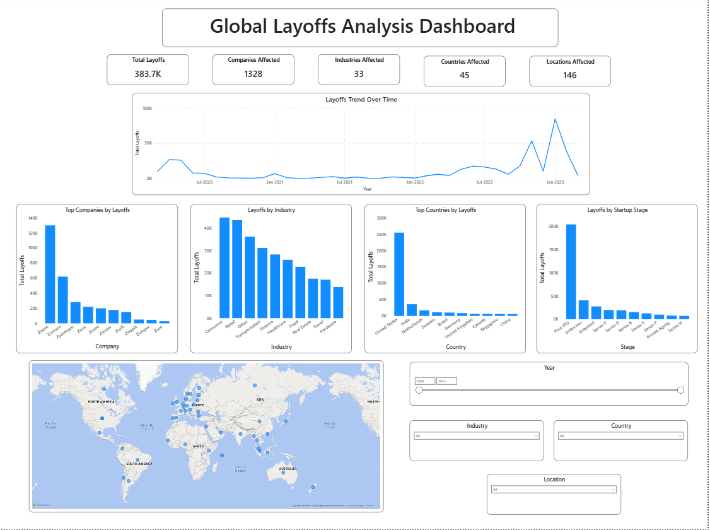

# Global Layoffs Analysis | End-to-End Data Analytics Project

## Project Overview
This project analyzes global layoffs across companies, industries, and countries to uncover major trends and patterns.

The analysis follows a complete **end-to-end data analytics workflow**, including data cleaning, feature engineering, exploratory data analysis, and dashboard development.

---

## Problem Statement
With increasing layoffs in the global tech ecosystem, this project aims to answer key questions:

- Which industries were most affected?
- Which companies laid off the most employees?
- How did layoffs change over time?
- Which countries experienced the highest layoffs?

---

## Tools & Technologies
🐍 Python | 🐼 Pandas | 📊 Matplotlib | 📓 Jupyter Notebook | 📈 Power BI | 📑 Excel

---

## Dataset

**Dataset Name:** World Layoffs Dataset  
**Source:** Layoffs.fyi (also available on Kaggle)

This dataset contains information about layoffs across companies worldwide, including details about company location, industry, funding stage, and the number of employees laid off.

**Dataset Size:** 2,362 records

The dataset was used to analyze layoff trends across companies, industries, countries, and time.

### Key Columns

| Column | Description |
|------|-------------|
| company | Name of the company |
| location | City where layoffs occurred |
| industry | Industry category |
| total_laid_off | Total number of employees laid off |
| percentage_laid_off | Percentage of workforce laid off |
| date | Date when layoffs were announced |
| stage | Funding stage of the company (e.g., Series A, Post-IPO) |
| country | Country where layoffs occurred |
| funds_raised_millions | Total funding raised by the company in millions |

Before performing analysis, the dataset was cleaned and transformed to handle missing values, standardize formats, and create new features such as **year and month** for time-based analysis.

---

## Project Workflow

### 1️⃣ Data Cleaning
- Handled missing values  
- Standardized column names  
- Converted date formats  
- Removed duplicate records  

### 2️⃣ Feature Engineering
New fields created to enhance analysis:

- **Year**
- **Month**
- Time-based aggregations

### 3️⃣ Exploratory Data Analysis (EDA)

Key analyses performed:

- Layoffs trend over time
- Layoffs by industry
- Top companies with highest layoffs
- Country-wise layoffs distribution
- Stage-wise layoffs patterns

### 4️⃣ Data Visualization

Visualizations were created using Python to highlight trends and patterns in the data.

### 5️⃣ Dashboard Development

An interactive **Power BI dashboard** was created to present insights clearly and allow interactive exploration.

---

## Dashboard



The dashboard provides an overview of layoffs with interactive insights including:

- Total layoffs overview  
- Layoffs trend over time  
- Top companies by layoffs  
- Industry-wise layoffs distribution  
- Global layoffs map visualization  
- Interactive filters for deeper analysis  

---

## Key Insights

- Layoffs peaked during **late 2022 and early 2023**.
- Some industries experienced **significantly higher layoffs**.
- A few countries accounted for **a major share of global layoffs**.
- Layoff patterns varied depending on **startup funding stages**.

---

## Project Structure
```
Global-Layoffs-Analysis
│
├── data
│ └── layoffs.csv
│ └──cleaned_layoffs_dataset.csv
│
├── layoffs_analysis.ipynb
│
├── image
│ └── dashboard.png
│
└── README.md

```
